logitudinal\_final\_proj
================
Lynette Pan
12/3/2018

Final Project: Smoking in the Framingham Heart Study
====================================================

Descriptive statistics
======================

    ##     cursmoke          randid        sex         totchol     
    ##  Min.   :0.0000   Min.   :   2448   1:5022   Min.   :107.0  
    ##  1st Qu.:0.0000   1st Qu.:2474378   2:6605   1st Qu.:210.0  
    ##  Median :0.0000   Median :5006008            Median :238.0  
    ##  Mean   :0.4325   Mean   :5004741            Mean   :241.2  
    ##  3rd Qu.:1.0000   3rd Qu.:7472730            3rd Qu.:268.0  
    ##  Max.   :1.0000   Max.   :9999312            Max.   :696.0  
    ##                                              NA's   :409    
    ##       age            sysbp           diabp           cigpday     
    ##  Min.   :32.00   Min.   : 83.5   Min.   : 30.00   Min.   : 0.00  
    ##  1st Qu.:48.00   1st Qu.:120.0   1st Qu.: 75.00   1st Qu.: 0.00  
    ##  Median :54.00   Median :132.0   Median : 82.00   Median : 0.00  
    ##  Mean   :54.79   Mean   :136.3   Mean   : 83.04   Mean   : 8.25  
    ##  3rd Qu.:62.00   3rd Qu.:149.0   3rd Qu.: 90.00   3rd Qu.:20.00  
    ##  Max.   :81.00   Max.   :295.0   Max.   :150.00   Max.   :90.00  
    ##                                                   NA's   :79     
    ##       bmi        diabetes   bpmeds         heartrte         glucose      
    ##  Min.   :14.43   0:11097   0   :10090   Min.   : 37.00   Min.   : 39.00  
    ##  1st Qu.:23.09   1:  530   1   :  944   1st Qu.: 69.00   1st Qu.: 72.00  
    ##  Median :25.48             NA's:  593   Median : 75.00   Median : 80.00  
    ##  Mean   :25.88                          Mean   : 76.78   Mean   : 84.12  
    ##  3rd Qu.:28.07                          3rd Qu.: 85.00   3rd Qu.: 89.00  
    ##  Max.   :56.80                          Max.   :220.00   Max.   :478.00  
    ##  NA's   :52                             NA's   :6        NA's   :1440    
    ##    educ      prevchd   prevap    prevmi    prevstrk  prevhyp 
    ##  1   :4690   0:10785   0:11000   0:11253   0:11475   0:6283  
    ##  2   :3410   1:  842   1:  627   1:  374   1:  152   1:5344  
    ##  3   :1885                                                   
    ##  4   :1347                                                   
    ##  NA's: 295                                                   
    ##                                                              
    ##                                                              
    ##       time          period           hdlc             ldlc      
    ##  Min.   :   0   Min.   :1.000   Min.   : 10.00   Min.   : 20.0  
    ##  1st Qu.:   0   1st Qu.:1.000   1st Qu.: 39.00   1st Qu.:145.0  
    ##  Median :2156   Median :2.000   Median : 48.00   Median :173.0  
    ##  Mean   :1957   Mean   :1.899   Mean   : 49.37   Mean   :176.5  
    ##  3rd Qu.:4252   3rd Qu.:3.000   3rd Qu.: 58.00   3rd Qu.:205.0  
    ##  Max.   :4854   Max.   :3.000   Max.   :189.00   Max.   :565.0  
    ##                                 NA's   :8600     NA's   :8601   
    ##      death            angina           hospmi           mi_fchd      
    ##  Min.   :0.0000   Min.   :0.0000   Min.   :0.00000   Min.   :0.0000  
    ##  1st Qu.:0.0000   1st Qu.:0.0000   1st Qu.:0.00000   1st Qu.:0.0000  
    ##  Median :0.0000   Median :0.0000   Median :0.00000   Median :0.0000  
    ##  Mean   :0.3033   Mean   :0.1636   Mean   :0.09925   Mean   :0.1538  
    ##  3rd Qu.:1.0000   3rd Qu.:0.0000   3rd Qu.:0.00000   3rd Qu.:0.0000  
    ##  Max.   :1.0000   Max.   :1.0000   Max.   :1.00000   Max.   :1.0000  
    ##                                                                      
    ##      anychd           stroke             cvd            hyperten     
    ##  Min.   :0.0000   Min.   :0.00000   Min.   :0.0000   Min.   :0.0000  
    ##  1st Qu.:0.0000   1st Qu.:0.00000   1st Qu.:0.0000   1st Qu.:0.0000  
    ##  Median :0.0000   Median :0.00000   Median :0.0000   Median :1.0000  
    ##  Mean   :0.2716   Mean   :0.09125   Mean   :0.2493   Mean   :0.7433  
    ##  3rd Qu.:1.0000   3rd Qu.:0.00000   3rd Qu.:0.0000   3rd Qu.:1.0000  
    ##  Max.   :1.0000   Max.   :1.00000   Max.   :1.0000   Max.   :1.0000  
    ##                                                                      
    ##      timeap         timemi        timemifc       timechd    
    ##  Min.   :   0   Min.   :   0   Min.   :   0   Min.   :   0  
    ##  1st Qu.:6224   1st Qu.:7212   1st Qu.:7050   1st Qu.:5598  
    ##  Median :8766   Median :8766   Median :8766   Median :8766  
    ##  Mean   :7242   Mean   :7594   Mean   :7543   Mean   :7008  
    ##  3rd Qu.:8766   3rd Qu.:8766   3rd Qu.:8766   3rd Qu.:8766  
    ##  Max.   :8766   Max.   :8766   Max.   :8766   Max.   :8766  
    ##                                                             
    ##     timestrk       timecvd        timedth        timehyp    
    ##  Min.   :   0   Min.   :   0   Min.   :  26   Min.   :   0  
    ##  1st Qu.:7295   1st Qu.:6004   1st Qu.:7798   1st Qu.:   0  
    ##  Median :8766   Median :8766   Median :8766   Median :2429  
    ##  Mean   :7661   Mean   :7166   Mean   :7854   Mean   :3599  
    ##  3rd Qu.:8766   3rd Qu.:8766   3rd Qu.:8766   3rd Qu.:7329  
    ##  Max.   :8766   Max.   :8766   Max.   :8766   Max.   :8766  
    ## 

missing values
==============

    ## # A tibble: 3 x 2
    ##   period sum_na_period
    ##    <int>         <int>
    ## 1      1             0
    ## 2      2             0
    ## 3      3             0

    ## 
    ##    1    2    3 
    ##  447  781 3206

    ## [1] 4434

    ##     ldlc     hdlc  glucose   bpmeds  totchol     educ  cigpday      bmi 
    ##     8601     8600     1440      593      409      295       79       52 
    ## heartrte cursmoke   randid      sex      age    sysbp    diabp diabetes 
    ##        6        0        0        0        0        0        0        0 
    ##  prevchd   prevap   prevmi prevstrk  prevhyp     time   period    death 
    ##        0        0        0        0        0        0        0        0 
    ##   angina   hospmi  mi_fchd   anychd   stroke      cvd hyperten   timeap 
    ##        0        0        0        0        0        0        0        0 
    ##   timemi timemifc  timechd timestrk  timecvd  timedth  timehyp 
    ##        0        0        0        0        0        0        0

-   The output tells us that 2243 samples are complete, 7077 samples miss both hdlc and ldlc, 4 samples miss only the glucose value and so on.

-   there are 447 patients who have only one obs; there are 781 patients who have only two obs and 3206 patients have all three obs. In total, there are 4434 patients in the study.

1. Target question:
-------------------

1.  Is there a relationship between age and smoking status? Does this relationship differ by sex?

### cursmoke vs age\_ctg without adjustment

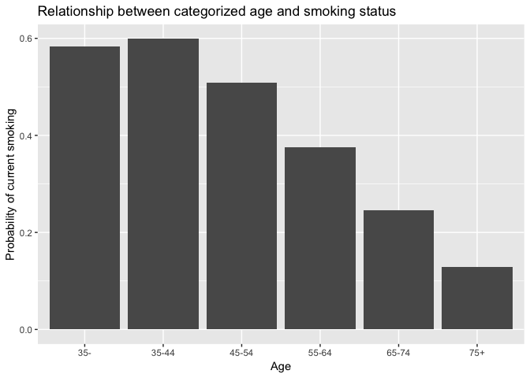

Finding confounders
-------------------

### age and cursmoke -- confounder: hdlc, ldlc

    ## $totchol
    ## 
    ## 
    ## variable       OR   lower_CI   upper_CI   potconf_OR  confounder 
    ## ---------  ------  ---------  ---------  -----------  -----------
    ## age         0.874      0.864      0.885        0.875  FALSE      
    ## 
    ## $sysbp
    ## 
    ## 
    ## variable       OR   lower_CI   upper_CI   potconf_OR  confounder 
    ## ---------  ------  ---------  ---------  -----------  -----------
    ## age         0.874      0.864      0.885        0.879  FALSE      
    ## 
    ## $diabp
    ## 
    ## 
    ## variable       OR   lower_CI   upper_CI   potconf_OR  confounder 
    ## ---------  ------  ---------  ---------  -----------  -----------
    ## age         0.874      0.864      0.885        0.875  FALSE      
    ## 
    ## $cigpday
    ## 
    ## 
    ## variable       OR   lower_CI   upper_CI   potconf_OR  confounder 
    ## ---------  ------  ---------  ---------  -----------  -----------
    ## age         0.874      0.864      0.885        0.875  FALSE      
    ## 
    ## $bmi
    ## 
    ## 
    ## variable       OR   lower_CI   upper_CI   potconf_OR  confounder 
    ## ---------  ------  ---------  ---------  -----------  -----------
    ## age         0.874      0.864      0.885        0.877  FALSE      
    ## 
    ## $diabetes
    ## 
    ## 
    ## variable       OR   lower_CI   upper_CI   potconf_OR  confounder 
    ## ---------  ------  ---------  ---------  -----------  -----------
    ## age         0.874      0.864      0.885        0.875  FALSE      
    ## 
    ## $bpmeds
    ## 
    ## 
    ## variable       OR   lower_CI   upper_CI   potconf_OR  confounder 
    ## ---------  ------  ---------  ---------  -----------  -----------
    ## age         0.874      0.864      0.885        0.877  FALSE      
    ## 
    ## $heartrte
    ## 
    ## 
    ## variable       OR   lower_CI   upper_CI   potconf_OR  confounder 
    ## ---------  ------  ---------  ---------  -----------  -----------
    ## age         0.874      0.864      0.885        0.872  FALSE      
    ## 
    ## $glucose
    ## 
    ## 
    ## variable       OR   lower_CI   upper_CI   potconf_OR  confounder 
    ## ---------  ------  ---------  ---------  -----------  -----------
    ## age         0.874      0.864      0.885        0.882  FALSE      
    ## 
    ## $educ
    ## 
    ## 
    ## variable       OR   lower_CI   upper_CI   potconf_OR  confounder 
    ## ---------  ------  ---------  ---------  -----------  -----------
    ## age         0.874      0.864      0.885        0.873  FALSE      
    ## 
    ## $prevchd
    ## 
    ## 
    ## variable       OR   lower_CI   upper_CI   potconf_OR  confounder 
    ## ---------  ------  ---------  ---------  -----------  -----------
    ## age         0.874      0.864      0.885        0.876  FALSE      
    ## 
    ## $prevap
    ## 
    ## 
    ## variable       OR   lower_CI   upper_CI   potconf_OR  confounder 
    ## ---------  ------  ---------  ---------  -----------  -----------
    ## age         0.874      0.864      0.885        0.876  FALSE      
    ## 
    ## $prevmi
    ## 
    ## 
    ## variable       OR   lower_CI   upper_CI   potconf_OR  confounder 
    ## ---------  ------  ---------  ---------  -----------  -----------
    ## age         0.874      0.864      0.885        0.875  FALSE      
    ## 
    ## $prevstrk
    ## 
    ## 
    ## variable       OR   lower_CI   upper_CI   potconf_OR  confounder 
    ## ---------  ------  ---------  ---------  -----------  -----------
    ## age         0.874      0.864      0.885        0.874  FALSE      
    ## 
    ## $prevhyp
    ## 
    ## 
    ## variable       OR   lower_CI   upper_CI   potconf_OR  confounder 
    ## ---------  ------  ---------  ---------  -----------  -----------
    ## age         0.874      0.864      0.885         0.88  FALSE      
    ## 
    ## $period
    ## 
    ## 
    ## variable       OR   lower_CI   upper_CI   potconf_OR  confounder 
    ## ---------  ------  ---------  ---------  -----------  -----------
    ## age         0.874      0.864      0.885        0.903  TRUE       
    ## 
    ## $hdlc
    ## 
    ## 
    ## variable       OR   lower_CI   upper_CI   potconf_OR  confounder 
    ## ---------  ------  ---------  ---------  -----------  -----------
    ## age         0.874      0.864      0.885        0.935  TRUE       
    ## 
    ## $ldlc
    ## 
    ## 
    ## variable       OR   lower_CI   upper_CI   potconf_OR  confounder 
    ## ---------  ------  ---------  ---------  -----------  -----------
    ## age         0.874      0.864      0.885        0.935  TRUE       
    ## 
    ## $death
    ## 
    ## 
    ## variable       OR   lower_CI   upper_CI   potconf_OR  confounder 
    ## ---------  ------  ---------  ---------  -----------  -----------
    ## age         0.874      0.864      0.885        0.867  FALSE      
    ## 
    ## $angina
    ## 
    ## 
    ## variable       OR   lower_CI   upper_CI   potconf_OR  confounder 
    ## ---------  ------  ---------  ---------  -----------  -----------
    ## age         0.874      0.864      0.885        0.874  FALSE      
    ## 
    ## $hospmi
    ## 
    ## 
    ## variable       OR   lower_CI   upper_CI   potconf_OR  confounder 
    ## ---------  ------  ---------  ---------  -----------  -----------
    ## age         0.874      0.864      0.885        0.874  FALSE      
    ## 
    ## $mi_fchd
    ## 
    ## 
    ## variable       OR   lower_CI   upper_CI   potconf_OR  confounder 
    ## ---------  ------  ---------  ---------  -----------  -----------
    ## age         0.874      0.864      0.885        0.873  FALSE      
    ## 
    ## $anychd
    ## 
    ## 
    ## variable       OR   lower_CI   upper_CI   potconf_OR  confounder 
    ## ---------  ------  ---------  ---------  -----------  -----------
    ## age         0.874      0.864      0.885        0.873  FALSE      
    ## 
    ## $stroke
    ## 
    ## 
    ## variable       OR   lower_CI   upper_CI   potconf_OR  confounder 
    ## ---------  ------  ---------  ---------  -----------  -----------
    ## age         0.874      0.864      0.885        0.873  FALSE      
    ## 
    ## $cvd
    ## 
    ## 
    ## variable       OR   lower_CI   upper_CI   potconf_OR  confounder 
    ## ---------  ------  ---------  ---------  -----------  -----------
    ## age         0.874      0.864      0.885        0.871  FALSE      
    ## 
    ## $hyperten
    ## 
    ## 
    ## variable       OR   lower_CI   upper_CI   potconf_OR  confounder 
    ## ---------  ------  ---------  ---------  -----------  -----------
    ## age         0.874      0.864      0.885        0.876  FALSE      
    ## 
    ## $age_ctg
    ## 
    ## 
    ## variable       OR   lower_CI   upper_CI   potconf_OR  confounder 
    ## ---------  ------  ---------  ---------  -----------  -----------
    ## age         0.874      0.864      0.885        0.861  TRUE

Finding modifier
----------------

    ## Warning in prop.test(4L, 7L): Chi-squared approximation may be incorrect

    ## Warning in prop.test(4L, 7L): Chi-squared approximation may be incorrect

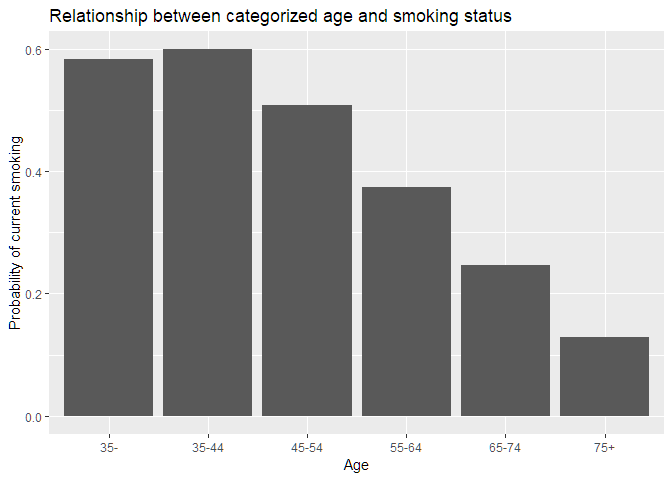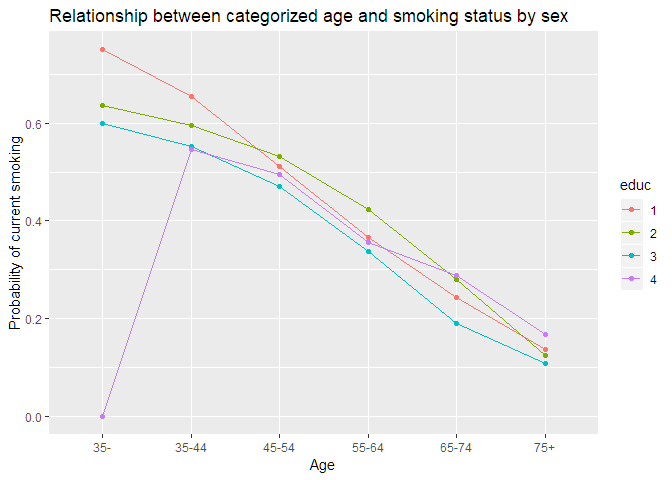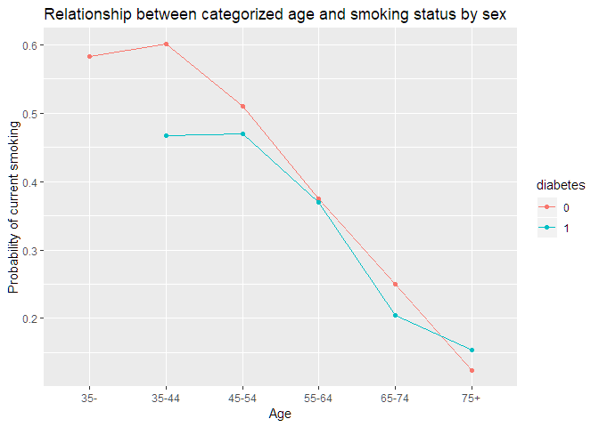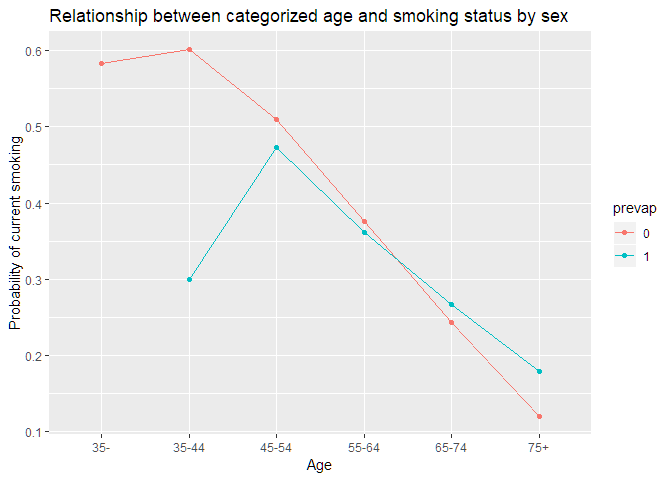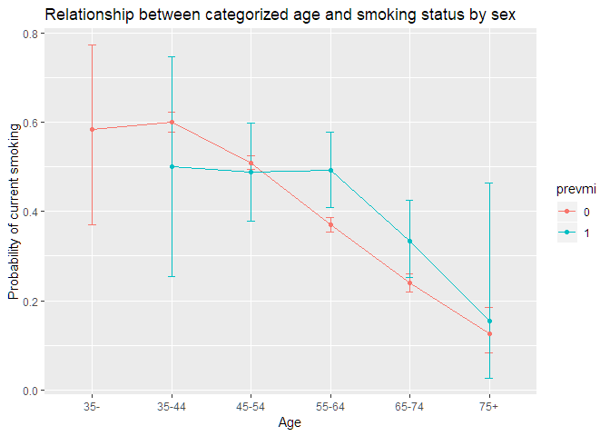

    ## Warning in prop.test(3L, 5L): Chi-squared approximation may be incorrect

    ## Warning in prop.test(3L, 5L): Chi-squared approximation may be incorrect

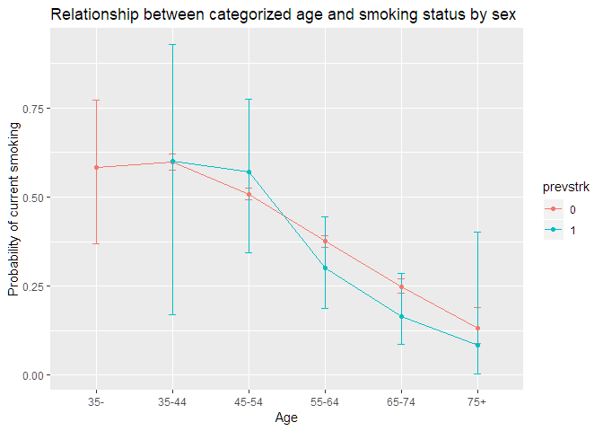

    ## Warning in prop.test(0L, 1L): Chi-squared approximation may be incorrect

    ## Warning in prop.test(0L, 1L): Chi-squared approximation may be incorrect

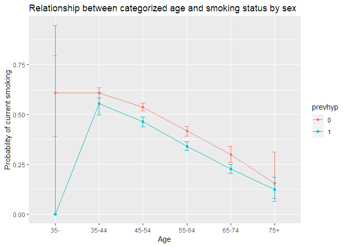

Fit model using glmer
---------------------

    ## Generalized linear mixed model fit by maximum likelihood (Adaptive
    ##   Gauss-Hermite Quadrature, nAGQ = 0) [glmerMod]
    ##  Family: binomial  ( logit )
    ## Formula: cursmoke ~ age * sex + educ + hdlc + ldlc + age * prevhyp + (1 |  
    ##     randid)
    ##    Data: frmgham
    ## 
    ##      AIC      BIC   logLik deviance df.resid 
    ##   3581.6   3653.5  -1778.8   3557.6     2939 
    ## 
    ## Scaled residuals: 
    ##     Min      1Q  Median      3Q     Max 
    ## -1.3319 -0.7483 -0.5126  1.0475  3.1773 
    ## 
    ## Random effects:
    ##  Groups Name        Variance Std.Dev.
    ##  randid (Intercept) 0.007196 0.08483 
    ## Number of obs: 2951, groups:  randid, 2951
    ## 
    ## Fixed effects:
    ##                Estimate Std. Error z value Pr(>|z|)    
    ## (Intercept)   2.1089335  0.6408587   3.291 0.000999 ***
    ## age          -0.0410951  0.0100028  -4.108 3.98e-05 ***
    ## sex2          1.5708819  0.6289735   2.498 0.012506 *  
    ## educ2         0.1879275  0.0983733   1.910 0.056088 .  
    ## educ3        -0.1768304  0.1215055  -1.455 0.145579    
    ## educ4        -0.1589561  0.1331928  -1.193 0.232701    
    ## hdlc         -0.0004737  0.0028068  -0.169 0.865979    
    ## ldlc          0.0005599  0.0008889   0.630 0.528808    
    ## prevhyp1     -0.1490198  0.6473765  -0.230 0.817944    
    ## age:sex2     -0.0321176  0.0105458  -3.046 0.002323 ** 
    ## age:prevhyp1 -0.0031512  0.0109453  -0.288 0.773418    
    ## ---
    ## Signif. codes:  0 '***' 0.001 '**' 0.01 '*' 0.05 '.' 0.1 ' ' 1
    ## 
    ## Correlation of Fixed Effects:
    ##             (Intr) age    sex2   educ2  educ3  educ4  hdlc   ldlc   prvhy1
    ## age         -0.934                                                        
    ## sex2        -0.529  0.536                                                 
    ## educ2       -0.159  0.107  0.012                                          
    ## educ3       -0.054  0.014 -0.031  0.385                                   
    ## educ4       -0.089  0.043  0.021  0.348  0.273                            
    ## hdlc        -0.255  0.022 -0.020 -0.023 -0.043 -0.049                     
    ## ldlc        -0.301  0.035  0.072 -0.016 -0.016 -0.013  0.189              
    ## prevhyp1    -0.583  0.643  0.042 -0.028 -0.046 -0.020  0.013 -0.032       
    ## age:sex2     0.529 -0.530 -0.990 -0.016  0.022 -0.008 -0.028 -0.095 -0.028
    ## age:prvhyp1  0.586 -0.656 -0.027  0.027  0.048  0.027 -0.010  0.025 -0.991
    ##             ag:sx2
    ## age               
    ## sex2              
    ## educ2             
    ## educ3             
    ## educ4             
    ## hdlc              
    ## ldlc              
    ## prevhyp1          
    ## age:sex2          
    ## age:prvhyp1  0.013

    ## Generalized linear mixed model fit by maximum likelihood (Adaptive
    ##   Gauss-Hermite Quadrature, nAGQ = 0) [glmerMod]
    ##  Family: binomial  ( logit )
    ## Formula: cursmoke ~ age * sex + educ + heartrte + hdlc + ldlc + age *  
    ##     prevhyp + (1 | randid)
    ##    Data: frmgham
    ## 
    ##      AIC      BIC   logLik deviance df.resid 
    ##   3550.2   3628.1  -1762.1   3524.2     2936 
    ## 
    ## Scaled residuals: 
    ##     Min      1Q  Median      3Q     Max 
    ## -1.6306 -0.7367 -0.4975  1.0269  3.3039 
    ## 
    ## Random effects:
    ##  Groups Name        Variance Std.Dev.
    ##  randid (Intercept) 0.004022 0.06342 
    ## Number of obs: 2949, groups:  randid, 2949
    ## 
    ## Fixed effects:
    ##                Estimate Std. Error z value Pr(>|z|)    
    ## (Intercept)   0.8260706  0.6896941   1.198 0.231020    
    ## age          -0.0400784  0.0100435  -3.990 6.59e-05 ***
    ## sex2          1.7330410  0.6326019   2.740 0.006152 ** 
    ## educ2         0.1809147  0.0988817   1.830 0.067309 .  
    ## educ3        -0.1575456  0.1221518  -1.290 0.197137    
    ## educ4        -0.1140740  0.1339943  -0.851 0.394584    
    ## heartrte      0.0166799  0.0033241   5.018 5.22e-07 ***
    ## hdlc         -0.0005108  0.0028173  -0.181 0.856131    
    ## ldlc          0.0004411  0.0008961   0.492 0.622528    
    ## prevhyp1     -0.1977370  0.6505668  -0.304 0.761169    
    ## age:sex2     -0.0356209  0.0106157  -3.356 0.000792 ***
    ## age:prevhyp1 -0.0032500  0.0110012  -0.295 0.767671    
    ## ---
    ## Signif. codes:  0 '***' 0.001 '**' 0.01 '*' 0.05 '.' 0.1 ' ' 1
    ## 
    ## Correlation of Fixed Effects:
    ##             (Intr) age    sex2   educ2  educ3  educ4  hertrt hdlc   ldlc  
    ## age         -0.876                                                        
    ## sex2        -0.503  0.535                                                 
    ## educ2       -0.142  0.107  0.013                                          
    ## educ3       -0.057  0.014 -0.030  0.385                                   
    ## educ4       -0.105  0.045  0.022  0.347  0.274                            
    ## heartrte    -0.360  0.013  0.027 -0.020  0.021  0.059                     
    ## hdlc        -0.236  0.022 -0.018 -0.023 -0.043 -0.050 -0.005              
    ## ldlc        -0.265  0.034  0.071 -0.015 -0.016 -0.017 -0.043  0.190       
    ## prevhyp1    -0.541  0.643  0.042 -0.025 -0.045 -0.018 -0.009  0.014 -0.032
    ## age:sex2     0.507 -0.529 -0.990 -0.017  0.020 -0.011 -0.040 -0.029 -0.093
    ## age:prvhyp1  0.550 -0.656 -0.028  0.025  0.048  0.023 -0.009 -0.010  0.026
    ##             prvhy1 ag:sx2
    ## age                      
    ## sex2                     
    ## educ2                    
    ## educ3                    
    ## educ4                    
    ## heartrte                 
    ## hdlc                     
    ## ldlc                     
    ## prevhyp1                 
    ## age:sex2    -0.028       
    ## age:prvhyp1 -0.991  0.014

    ## Generalized linear mixed model fit by maximum likelihood (Adaptive
    ##   Gauss-Hermite Quadrature, nAGQ = 0) [glmerMod]
    ##  Family: poisson  ( log )
    ## Formula: cigpday ~ age * sex + educ + heartrte + age * prevhyp + (1 |  
    ##     randid)
    ##    Data: frmgham_smoker
    ## 
    ##      AIC      BIC   logLik deviance df.resid 
    ##  35492.2  35563.5 -17735.1  35470.2     4820 
    ## 
    ## Scaled residuals: 
    ##     Min      1Q  Median      3Q     Max 
    ## -4.2883 -0.6765 -0.0172  0.4440  5.9212 
    ## 
    ## Random effects:
    ##  Groups Name        Variance Std.Dev.
    ##  randid (Intercept) 0.4383   0.662   
    ## Number of obs: 4831, groups:  randid, 2237
    ## 
    ## Fixed effects:
    ##                Estimate Std. Error z value Pr(>|z|)    
    ## (Intercept)   2.6313565  0.0699624  37.611  < 2e-16 ***
    ## age           0.0029277  0.0011204   2.613 0.008974 ** 
    ## sex2         -0.9198080  0.0812947 -11.314  < 2e-16 ***
    ## educ2         0.1034282  0.0350326   2.952 0.003154 ** 
    ## educ3         0.0481747  0.0446752   1.078 0.280886    
    ## educ4         0.0057701  0.0484108   0.119 0.905124    
    ## heartrte      0.0017845  0.0004722   3.779 0.000157 ***
    ## prevhyp1      0.4918777  0.0701004   7.017 2.27e-12 ***
    ## age:sex2      0.0085697  0.0014519   5.903 3.58e-09 ***
    ## age:prevhyp1 -0.0089792  0.0012799  -7.016 2.29e-12 ***
    ## ---
    ## Signif. codes:  0 '***' 0.001 '**' 0.01 '*' 0.05 '.' 0.1 ' ' 1
    ## 
    ## Correlation of Fixed Effects:
    ##             (Intr) age    sex2   educ2  educ3  educ4  hertrt prvhy1 ag:sx2
    ## age         -0.771                                                        
    ## sex2        -0.492  0.538                                                 
    ## educ2       -0.241  0.054 -0.031                                          
    ## educ3       -0.169  0.024 -0.051  0.363                                   
    ## educ4       -0.192  0.026  0.010  0.317  0.247                            
    ## heartrte    -0.435 -0.096 -0.044 -0.008  0.000  0.015                     
    ## prevhyp1    -0.288  0.362  0.077 -0.019 -0.012  0.002 -0.041              
    ## age:sex2     0.465 -0.574 -0.929 -0.013 -0.001 -0.002  0.036 -0.067       
    ## age:prvhyp1  0.336 -0.432 -0.074  0.016  0.012 -0.003  0.031 -0.979  0.065

1.  Is there a relationship between the number of cigarettes smoked per day and age? Does this relationship differ by sex?

While answering these questions, please account for any confounders that you have evidence may impact the relationship between age and sex with smoking.

    ## Warning: Removed 79 rows containing non-finite values (stat_smooth).

    ## Warning: Removed 79 rows containing missing values (geom_point).

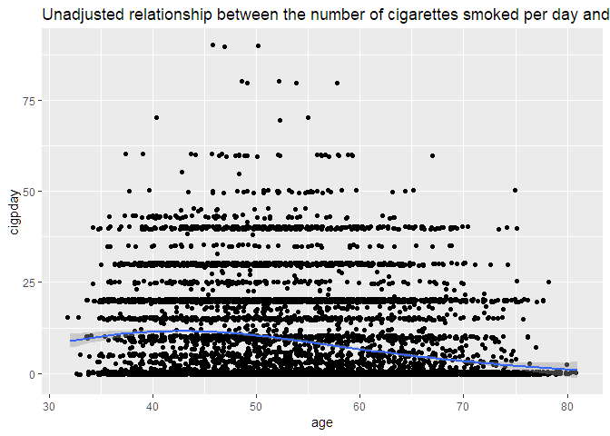

    ##    Min. 1st Qu.  Median    Mean 3rd Qu.    Max. 
    ##    1.00   10.00   20.00   19.25   25.00   90.00

    ## `stat_bin()` using `bins = 30`. Pick better value with `binwidth`.

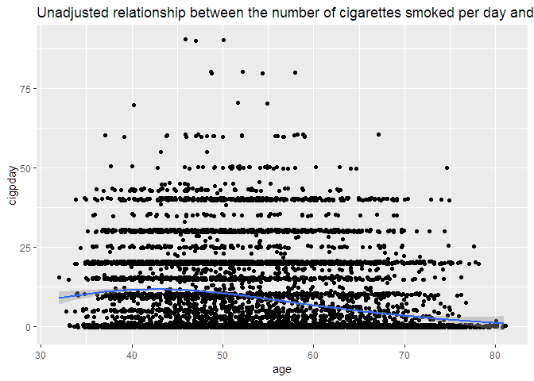

    ## Beginning Cgee S-function, @(#) geeformula.q 4.13 98/01/27

    ## running glm to get initial regression estimate

    ## (Intercept)         age 
    ##  4.05032331 -0.03649173

    ## Beginning Cgee S-function, @(#) geeformula.q 4.13 98/01/27
    ## running glm to get initial regression estimate

    ## (Intercept)         age 
    ##  0.82801390 -0.03120521

    ## Beginning Cgee S-function, @(#) geeformula.q 4.13 98/01/27
    ## running glm to get initial regression estimate

    ##   (Intercept)           age       totchol 
    ##  8.205811e-01 -3.137216e-02  5.639067e-05

    ## Beginning Cgee S-function, @(#) geeformula.q 4.13 98/01/27
    ## running glm to get initial regression estimate

    ##  (Intercept)          age        sysbp 
    ##  1.066322565 -0.028655440 -0.002785127

    ## Beginning Cgee S-function, @(#) geeformula.q 4.13 98/01/27
    ## running glm to get initial regression estimate

    ## (Intercept)         age       diabp 
    ##  1.23996287 -0.03046680 -0.00546731

    ## Beginning Cgee S-function, @(#) geeformula.q 4.13 98/01/27
    ## running glm to get initial regression estimate

    ## (Intercept)         age         bmi 
    ##  1.91200020 -0.02985014 -0.04534089

    ## Beginning Cgee S-function, @(#) geeformula.q 4.13 98/01/27
    ## running glm to get initial regression estimate

    ## (Intercept)         age   diabetes1 
    ##  0.82084112 -0.03102093 -0.06646395

    ## Beginning Cgee S-function, @(#) geeformula.q 4.13 98/01/27
    ## running glm to get initial regression estimate

    ## (Intercept)         age     bpmeds1 
    ##  0.76865830 -0.02980929 -0.20231430

    ## Beginning Cgee S-function, @(#) geeformula.q 4.13 98/01/27
    ## running glm to get initial regression estimate

    ##  (Intercept)          age     heartrte 
    ##  0.363609848 -0.031496341  0.006206298

    ## Beginning Cgee S-function, @(#) geeformula.q 4.13 98/01/27
    ## running glm to get initial regression estimate

    ##  (Intercept)          age      glucose 
    ##  0.927633265 -0.030768877 -0.001514277

    ## Beginning Cgee S-function, @(#) geeformula.q 4.13 98/01/27
    ## running glm to get initial regression estimate

    ## (Intercept)         age       educ2       educ3       educ4 
    ##  0.82982420 -0.03097717  0.03249024 -0.11339801 -0.04966555

    ## Beginning Cgee S-function, @(#) geeformula.q 4.13 98/01/27
    ## running glm to get initial regression estimate

    ## (Intercept)         age    prevchd1 
    ##  0.83742613 -0.03143404  0.04274108

    ## Beginning Cgee S-function, @(#) geeformula.q 4.13 98/01/27
    ## running glm to get initial regression estimate

    ## (Intercept)         age     prevap1 
    ##  0.82587661 -0.03115428 -0.01231164

    ## Beginning Cgee S-function, @(#) geeformula.q 4.13 98/01/27
    ## running glm to get initial regression estimate

    ## (Intercept)         age     prevmi1 
    ##  0.84424516 -0.03162447  0.19199742

    ## Beginning Cgee S-function, @(#) geeformula.q 4.13 98/01/27
    ## running glm to get initial regression estimate

    ## (Intercept)         age   prevstrk1 
    ##  0.82082170 -0.03103646 -0.17419051

    ## Beginning Cgee S-function, @(#) geeformula.q 4.13 98/01/27
    ## running glm to get initial regression estimate

    ## (Intercept)         age    prevhyp1 
    ##  0.73776289 -0.02834957 -0.14914763

    ## Beginning Cgee S-function, @(#) geeformula.q 4.13 98/01/27
    ## running glm to get initial regression estimate

    ##  (Intercept)          age       period 
    ##  0.827036125 -0.031078124 -0.003147334

    ## Beginning Cgee S-function, @(#) geeformula.q 4.13 98/01/27
    ## running glm to get initial regression estimate

    ##  (Intercept)          age         hdlc 
    ##  1.650730480 -0.044188754 -0.002226944

    ## Beginning Cgee S-function, @(#) geeformula.q 4.13 98/01/27
    ## running glm to get initial regression estimate

    ##   (Intercept)           age          ldlc 
    ##  1.5620275288 -0.0441417089 -0.0001318165

    ## Beginning Cgee S-function, @(#) geeformula.q 4.13 98/01/27
    ## running glm to get initial regression estimate

    ## (Intercept)         age       death 
    ##  0.96470363 -0.03544637  0.28952416

    ## Beginning Cgee S-function, @(#) geeformula.q 4.13 98/01/27
    ## running glm to get initial regression estimate

    ## (Intercept)         age      angina 
    ##  0.82626015 -0.03109184 -0.02757864

    ## Beginning Cgee S-function, @(#) geeformula.q 4.13 98/01/27
    ## running glm to get initial regression estimate

    ## (Intercept)         age      hospmi 
    ##  0.82847349 -0.03169515  0.23878512

    ## Beginning Cgee S-function, @(#) geeformula.q 4.13 98/01/27
    ## running glm to get initial regression estimate

    ## (Intercept)         age     mi_fchd 
    ##  0.84568736 -0.03223356  0.22859760

    ## Beginning Cgee S-function, @(#) geeformula.q 4.13 98/01/27
    ## running glm to get initial regression estimate

    ## (Intercept)         age      anychd 
    ##  0.84328875 -0.03204868  0.10966852

    ## Beginning Cgee S-function, @(#) geeformula.q 4.13 98/01/27
    ## running glm to get initial regression estimate

    ## (Intercept)         age      stroke 
    ##  0.86181547 -0.03211417  0.16410163

    ## Beginning Cgee S-function, @(#) geeformula.q 4.13 98/01/27
    ## running glm to get initial regression estimate

    ## (Intercept)         age         cvd 
    ##  0.88338256 -0.03325683  0.21247220

    ## Beginning Cgee S-function, @(#) geeformula.q 4.13 98/01/27
    ## running glm to get initial regression estimate

    ## (Intercept)         age    hyperten 
    ##  0.86000759 -0.02965192 -0.16074355

    ## Beginning Cgee S-function, @(#) geeformula.q 4.13 98/01/27
    ## running glm to get initial regression estimate

    ##  (Intercept)          age age_ctg35-44 age_ctg45-54 age_ctg55-64 
    ##   0.48208732  -0.03029572   0.23914998   0.34671138   0.32978877 
    ## age_ctg65-74   age_ctg75+ 
    ##   0.18781581  -0.22088289

    ## $cursmoke
    ## 
    ## 
    ## variable       OR   lower_CI   upper_CI   potconf_OR  confounder 
    ## ---------  ------  ---------  ---------  -----------  -----------
    ## age         0.975      0.973      0.978        0.973  FALSE      
    ## 
    ## $totchol
    ## 
    ## 
    ## variable       OR   lower_CI   upper_CI   potconf_OR  confounder 
    ## ---------  ------  ---------  ---------  -----------  -----------
    ## age         0.975      0.973      0.978        0.973  FALSE      
    ## 
    ## $sysbp
    ## 
    ## 
    ## variable       OR   lower_CI   upper_CI   potconf_OR  confounder 
    ## ---------  ------  ---------  ---------  -----------  -----------
    ## age         0.975      0.973      0.978        0.974  FALSE      
    ## 
    ## $diabp
    ## 
    ## 
    ## variable       OR   lower_CI   upper_CI   potconf_OR  confounder 
    ## ---------  ------  ---------  ---------  -----------  -----------
    ## age         0.975      0.973      0.978        0.974  FALSE      
    ## 
    ## $bmi
    ## 
    ## 
    ## variable       OR   lower_CI   upper_CI   potconf_OR  confounder 
    ## ---------  ------  ---------  ---------  -----------  -----------
    ## age         0.975      0.973      0.978        0.974  FALSE      
    ## 
    ## $diabetes
    ## 
    ## 
    ## variable       OR   lower_CI   upper_CI   potconf_OR  confounder 
    ## ---------  ------  ---------  ---------  -----------  -----------
    ## age         0.975      0.973      0.978        0.973  FALSE      
    ## 
    ## $bpmeds
    ## 
    ## 
    ## variable       OR   lower_CI   upper_CI   potconf_OR  confounder 
    ## ---------  ------  ---------  ---------  -----------  -----------
    ## age         0.975      0.973      0.978        0.974  FALSE      
    ## 
    ## $heartrte
    ## 
    ## 
    ## variable       OR   lower_CI   upper_CI   potconf_OR  confounder 
    ## ---------  ------  ---------  ---------  -----------  -----------
    ## age         0.975      0.973      0.978        0.973  TRUE       
    ## 
    ## $glucose
    ## 
    ## 
    ## variable       OR   lower_CI   upper_CI   potconf_OR  confounder 
    ## ---------  ------  ---------  ---------  -----------  -----------
    ## age         0.975      0.973      0.978        0.973  FALSE      
    ## 
    ## $educ
    ## 
    ## 
    ## variable       OR   lower_CI   upper_CI   potconf_OR  confounder 
    ## ---------  ------  ---------  ---------  -----------  -----------
    ## age         0.975      0.973      0.978        0.973  FALSE      
    ## 
    ## $prevchd
    ## 
    ## 
    ## variable       OR   lower_CI   upper_CI   potconf_OR  confounder 
    ## ---------  ------  ---------  ---------  -----------  -----------
    ## age         0.975      0.973      0.978        0.974  FALSE      
    ## 
    ## $prevap
    ## 
    ## 
    ## variable       OR   lower_CI   upper_CI   potconf_OR  confounder 
    ## ---------  ------  ---------  ---------  -----------  -----------
    ## age         0.975      0.973      0.978        0.974  FALSE      
    ## 
    ## $prevmi
    ## 
    ## 
    ## variable       OR   lower_CI   upper_CI   potconf_OR  confounder 
    ## ---------  ------  ---------  ---------  -----------  -----------
    ## age         0.975      0.973      0.978        0.973  FALSE      
    ## 
    ## $prevstrk
    ## 
    ## 
    ## variable       OR   lower_CI   upper_CI   potconf_OR  confounder 
    ## ---------  ------  ---------  ---------  -----------  -----------
    ## age         0.975      0.973      0.978        0.973  FALSE      
    ## 
    ## $prevhyp
    ## 
    ## 
    ## variable       OR   lower_CI   upper_CI   potconf_OR  confounder 
    ## ---------  ------  ---------  ---------  -----------  -----------
    ## age         0.975      0.973      0.978        0.975  FALSE      
    ## 
    ## $period
    ## 
    ## 
    ## variable       OR   lower_CI   upper_CI   potconf_OR  confounder 
    ## ---------  ------  ---------  ---------  -----------  -----------
    ## age         0.975      0.973      0.978        0.972  TRUE       
    ## 
    ## $hdlc
    ## 
    ## 
    ## variable       OR   lower_CI   upper_CI   potconf_OR  confounder 
    ## ---------  ------  ---------  ---------  -----------  -----------
    ## age         0.975      0.973      0.978        0.957  TRUE       
    ## 
    ## $ldlc
    ## 
    ## 
    ## variable       OR   lower_CI   upper_CI   potconf_OR  confounder 
    ## ---------  ------  ---------  ---------  -----------  -----------
    ## age         0.975      0.973      0.978        0.957  TRUE       
    ## 
    ## $death
    ## 
    ## 
    ## variable       OR   lower_CI   upper_CI   potconf_OR  confounder 
    ## ---------  ------  ---------  ---------  -----------  -----------
    ## age         0.975      0.973      0.978        0.971  TRUE       
    ## 
    ## $angina
    ## 
    ## 
    ## variable       OR   lower_CI   upper_CI   potconf_OR  confounder 
    ## ---------  ------  ---------  ---------  -----------  -----------
    ## age         0.975      0.973      0.978        0.973  FALSE      
    ## 
    ## $hospmi
    ## 
    ## 
    ## variable       OR   lower_CI   upper_CI   potconf_OR  confounder 
    ## ---------  ------  ---------  ---------  -----------  -----------
    ## age         0.975      0.973      0.978        0.973  FALSE      
    ## 
    ## $mi_fchd
    ## 
    ## 
    ## variable       OR   lower_CI   upper_CI   potconf_OR  confounder 
    ## ---------  ------  ---------  ---------  -----------  -----------
    ## age         0.975      0.973      0.978        0.973  FALSE      
    ## 
    ## $anychd
    ## 
    ## 
    ## variable       OR   lower_CI   upper_CI   potconf_OR  confounder 
    ## ---------  ------  ---------  ---------  -----------  -----------
    ## age         0.975      0.973      0.978        0.973  FALSE      
    ## 
    ## $stroke
    ## 
    ## 
    ## variable       OR   lower_CI   upper_CI   potconf_OR  confounder 
    ## ---------  ------  ---------  ---------  -----------  -----------
    ## age         0.975      0.973      0.978        0.973  FALSE      
    ## 
    ## $cvd
    ## 
    ## 
    ## variable       OR   lower_CI   upper_CI   potconf_OR  confounder 
    ## ---------  ------  ---------  ---------  -----------  -----------
    ## age         0.975      0.973      0.978        0.972  TRUE       
    ## 
    ## $hyperten
    ## 
    ## 
    ## variable       OR   lower_CI   upper_CI   potconf_OR  confounder 
    ## ---------  ------  ---------  ---------  -----------  -----------
    ## age         0.975      0.973      0.978        0.974  FALSE      
    ## 
    ## $age_ctg
    ## 
    ## 
    ## variable       OR   lower_CI   upper_CI   potconf_OR  confounder 
    ## ---------  ------  ---------  ---------  -----------  -----------
    ## age         0.975      0.973      0.978        0.972  TRUE

    ## $cursmoke
    ## 
    ## 
    ## variable       OR   lower_CI   upper_CI   potconf_OR  confounder 
    ## ---------  ------  ---------  ---------  -----------  -----------
    ## age         0.975      0.973      0.978        0.973  FALSE      
    ## 
    ## $totchol
    ## 
    ## 
    ## variable       OR   lower_CI   upper_CI   potconf_OR  confounder 
    ## ---------  ------  ---------  ---------  -----------  -----------
    ## age         0.975      0.973      0.978        0.973  FALSE      
    ## 
    ## $sysbp
    ## 
    ## 
    ## variable       OR   lower_CI   upper_CI   potconf_OR  confounder 
    ## ---------  ------  ---------  ---------  -----------  -----------
    ## age         0.975      0.973      0.978        0.974  FALSE      
    ## 
    ## $diabp
    ## 
    ## 
    ## variable       OR   lower_CI   upper_CI   potconf_OR  confounder 
    ## ---------  ------  ---------  ---------  -----------  -----------
    ## age         0.975      0.973      0.978        0.974  FALSE      
    ## 
    ## $bmi
    ## 
    ## 
    ## variable       OR   lower_CI   upper_CI   potconf_OR  confounder 
    ## ---------  ------  ---------  ---------  -----------  -----------
    ## age         0.975      0.973      0.978        0.974  FALSE      
    ## 
    ## $diabetes
    ## 
    ## 
    ## variable       OR   lower_CI   upper_CI   potconf_OR  confounder 
    ## ---------  ------  ---------  ---------  -----------  -----------
    ## age         0.975      0.973      0.978        0.973  FALSE      
    ## 
    ## $bpmeds
    ## 
    ## 
    ## variable       OR   lower_CI   upper_CI   potconf_OR  confounder 
    ## ---------  ------  ---------  ---------  -----------  -----------
    ## age         0.975      0.973      0.978        0.974  FALSE      
    ## 
    ## $heartrte
    ## 
    ## 
    ## variable       OR   lower_CI   upper_CI   potconf_OR  confounder 
    ## ---------  ------  ---------  ---------  -----------  -----------
    ## age         0.975      0.973      0.978        0.973  TRUE       
    ## 
    ## $glucose
    ## 
    ## 
    ## variable       OR   lower_CI   upper_CI   potconf_OR  confounder 
    ## ---------  ------  ---------  ---------  -----------  -----------
    ## age         0.975      0.973      0.978        0.973  FALSE      
    ## 
    ## $educ
    ## 
    ## 
    ## variable       OR   lower_CI   upper_CI   potconf_OR  confounder 
    ## ---------  ------  ---------  ---------  -----------  -----------
    ## age         0.975      0.973      0.978        0.973  FALSE      
    ## 
    ## $prevchd
    ## 
    ## 
    ## variable       OR   lower_CI   upper_CI   potconf_OR  confounder 
    ## ---------  ------  ---------  ---------  -----------  -----------
    ## age         0.975      0.973      0.978        0.974  FALSE      
    ## 
    ## $prevap
    ## 
    ## 
    ## variable       OR   lower_CI   upper_CI   potconf_OR  confounder 
    ## ---------  ------  ---------  ---------  -----------  -----------
    ## age         0.975      0.973      0.978        0.974  FALSE      
    ## 
    ## $prevmi
    ## 
    ## 
    ## variable       OR   lower_CI   upper_CI   potconf_OR  confounder 
    ## ---------  ------  ---------  ---------  -----------  -----------
    ## age         0.975      0.973      0.978        0.973  FALSE      
    ## 
    ## $prevstrk
    ## 
    ## 
    ## variable       OR   lower_CI   upper_CI   potconf_OR  confounder 
    ## ---------  ------  ---------  ---------  -----------  -----------
    ## age         0.975      0.973      0.978        0.973  FALSE      
    ## 
    ## $prevhyp
    ## 
    ## 
    ## variable       OR   lower_CI   upper_CI   potconf_OR  confounder 
    ## ---------  ------  ---------  ---------  -----------  -----------
    ## age         0.975      0.973      0.978        0.975  FALSE      
    ## 
    ## $period
    ## 
    ## 
    ## variable       OR   lower_CI   upper_CI   potconf_OR  confounder 
    ## ---------  ------  ---------  ---------  -----------  -----------
    ## age         0.975      0.973      0.978        0.972  TRUE       
    ## 
    ## $hdlc
    ## 
    ## 
    ## variable       OR   lower_CI   upper_CI   potconf_OR  confounder 
    ## ---------  ------  ---------  ---------  -----------  -----------
    ## age         0.975      0.973      0.978        0.957  TRUE       
    ## 
    ## $ldlc
    ## 
    ## 
    ## variable       OR   lower_CI   upper_CI   potconf_OR  confounder 
    ## ---------  ------  ---------  ---------  -----------  -----------
    ## age         0.975      0.973      0.978        0.957  TRUE       
    ## 
    ## $death
    ## 
    ## 
    ## variable       OR   lower_CI   upper_CI   potconf_OR  confounder 
    ## ---------  ------  ---------  ---------  -----------  -----------
    ## age         0.975      0.973      0.978        0.971  TRUE       
    ## 
    ## $angina
    ## 
    ## 
    ## variable       OR   lower_CI   upper_CI   potconf_OR  confounder 
    ## ---------  ------  ---------  ---------  -----------  -----------
    ## age         0.975      0.973      0.978        0.973  FALSE      
    ## 
    ## $hospmi
    ## 
    ## 
    ## variable       OR   lower_CI   upper_CI   potconf_OR  confounder 
    ## ---------  ------  ---------  ---------  -----------  -----------
    ## age         0.975      0.973      0.978        0.973  FALSE      
    ## 
    ## $mi_fchd
    ## 
    ## 
    ## variable       OR   lower_CI   upper_CI   potconf_OR  confounder 
    ## ---------  ------  ---------  ---------  -----------  -----------
    ## age         0.975      0.973      0.978        0.973  FALSE      
    ## 
    ## $anychd
    ## 
    ## 
    ## variable       OR   lower_CI   upper_CI   potconf_OR  confounder 
    ## ---------  ------  ---------  ---------  -----------  -----------
    ## age         0.975      0.973      0.978        0.973  FALSE      
    ## 
    ## $stroke
    ## 
    ## 
    ## variable       OR   lower_CI   upper_CI   potconf_OR  confounder 
    ## ---------  ------  ---------  ---------  -----------  -----------
    ## age         0.975      0.973      0.978        0.973  FALSE      
    ## 
    ## $cvd
    ## 
    ## 
    ## variable       OR   lower_CI   upper_CI   potconf_OR  confounder 
    ## ---------  ------  ---------  ---------  -----------  -----------
    ## age         0.975      0.973      0.978        0.972  TRUE       
    ## 
    ## $hyperten
    ## 
    ## 
    ## variable       OR   lower_CI   upper_CI   potconf_OR  confounder 
    ## ---------  ------  ---------  ---------  -----------  -----------
    ## age         0.975      0.973      0.978        0.974  FALSE      
    ## 
    ## $age_ctg
    ## 
    ## 
    ## variable       OR   lower_CI   upper_CI   potconf_OR  confounder 
    ## ---------  ------  ---------  ---------  -----------  -----------
    ## age         0.975      0.973      0.978        0.972  TRUE

    ## Generalized linear mixed model fit by maximum likelihood (Adaptive
    ##   Gauss-Hermite Quadrature, nAGQ = 0) [glmerMod]
    ##  Family: poisson  ( log )
    ## Formula: cigpday ~ age + sex + heartrte + hdlc + ldlc + totchol + (1 |  
    ##     randid)
    ##    Data: frmgham_smoker
    ## 
    ##      AIC      BIC   logLik deviance df.resid 
    ##   7876.2   7915.7  -3930.1   7860.2     1013 
    ## 
    ## Scaled residuals: 
    ##      Min       1Q   Median       3Q      Max 
    ## -1.83291 -0.26160  0.05622  0.18987  0.52723 
    ## 
    ## Random effects:
    ##  Groups Name        Variance Std.Dev.
    ##  randid (Intercept) 0.3593   0.5994  
    ## Number of obs: 1021, groups:  randid, 1021
    ## 
    ## Fixed effects:
    ##               Estimate Std. Error z value Pr(>|z|)    
    ## (Intercept)  3.6529114  0.2412169  15.144  < 2e-16 ***
    ## age         -0.0167559  0.0028804  -5.817 5.99e-09 ***
    ## sex2        -0.2544544  0.0438405  -5.804 6.47e-09 ***
    ## heartrte     0.0041263  0.0016404   2.515   0.0119 *  
    ## hdlc        -0.0027549  0.0017678  -1.558   0.1191    
    ## ldlc        -0.0004538  0.0011361  -0.399   0.6896    
    ## totchol      0.0007457  0.0011999   0.621   0.5343    
    ## ---
    ## Signif. codes:  0 '***' 0.001 '**' 0.01 '*' 0.05 '.' 0.1 ' ' 1
    ## 
    ## Correlation of Fixed Effects:
    ##          (Intr) age    sex2   hertrt hdlc   ldlc  
    ## age      -0.705                                   
    ## sex2      0.033  0.074                            
    ## heartrte -0.494  0.002 -0.030                     
    ## hdlc     -0.225  0.073 -0.241  0.017              
    ## ldlc     -0.048  0.084  0.006  0.031  0.579       
    ## totchol  -0.110 -0.074 -0.068 -0.060 -0.561 -0.917

    ## Generalized linear mixed model fit by maximum likelihood (Adaptive
    ##   Gauss-Hermite Quadrature, nAGQ = 0) [glmerMod]
    ##  Family: poisson  ( log )
    ## Formula: cigpday ~ age + sex + heartrte + hdlc + totchol + (1 | randid)
    ##    Data: frmgham_smoker
    ## 
    ##      AIC      BIC   logLik deviance df.resid 
    ##   7874.4   7908.9  -3930.2   7860.4     1014 
    ## 
    ## Scaled residuals: 
    ##      Min       1Q   Median       3Q      Max 
    ## -1.83512 -0.26504  0.05623  0.18987  0.52476 
    ## 
    ## Random effects:
    ##  Groups Name        Variance Std.Dev.
    ##  randid (Intercept) 0.3593   0.5995  
    ## Number of obs: 1021, groups:  randid, 1021
    ## 
    ## Fixed effects:
    ##               Estimate Std. Error z value Pr(>|z|)    
    ## (Intercept)  3.6482799  0.2409483  15.141  < 2e-16 ***
    ## age         -0.0166593  0.0028704  -5.804 6.48e-09 ***
    ## sex2        -0.2543480  0.0438424  -5.801 6.58e-09 ***
    ## heartrte     0.0041465  0.0016398   2.529   0.0114 *  
    ## hdlc        -0.0023462  0.0014415  -1.628   0.1036    
    ## totchol      0.0003063  0.0004795   0.639   0.5229    
    ## ---
    ## Signif. codes:  0 '***' 0.001 '**' 0.01 '*' 0.05 '.' 0.1 ' ' 1
    ## 
    ## Correlation of Fixed Effects:
    ##          (Intr) age    sex2   hertrt hdlc  
    ## age      -0.705                            
    ## sex2      0.033  0.074                     
    ## heartrte -0.494 -0.001 -0.030              
    ## hdlc     -0.242  0.030 -0.300 -0.001       
    ## totchol  -0.386  0.008 -0.157 -0.079 -0.092

    ## Generalized linear mixed model fit by maximum likelihood (Adaptive
    ##   Gauss-Hermite Quadrature, nAGQ = 0) [glmerMod]
    ##  Family: poisson  ( log )
    ## Formula: cigpday ~ age + sex + heartrte + hdlc + (1 | randid)
    ##    Data: frmgham_smoker
    ## 
    ##      AIC      BIC   logLik deviance df.resid 
    ##   7872.8   7902.4  -3930.4   7860.8     1015 
    ## 
    ## Scaled residuals: 
    ##      Min       1Q   Median       3Q      Max 
    ## -1.83222 -0.26666  0.05589  0.19140  0.52811 
    ## 
    ## Random effects:
    ##  Groups Name        Variance Std.Dev.
    ##  randid (Intercept) 0.3595   0.5996  
    ## Number of obs: 1021, groups:  randid, 1021
    ## 
    ## Fixed effects:
    ##              Estimate Std. Error z value Pr(>|z|)    
    ## (Intercept)  3.707732   0.222277  16.681  < 2e-16 ***
    ## age         -0.016674   0.002871  -5.809 6.30e-09 ***
    ## sex2        -0.249947   0.043303  -5.772 7.83e-09 ***
    ## heartrte     0.004229   0.001635   2.587  0.00969 ** 
    ## hdlc        -0.002262   0.001436  -1.576  0.11513    
    ## ---
    ## Signif. codes:  0 '***' 0.001 '**' 0.01 '*' 0.05 '.' 0.1 ' ' 1
    ## 
    ## Correlation of Fixed Effects:
    ##          (Intr) age    sex2   hertrt
    ## age      -0.761                     
    ## sex2     -0.030  0.076              
    ## heartrte -0.570  0.000 -0.043       
    ## hdlc     -0.302  0.031 -0.320 -0.008

    ## Generalized linear mixed model fit by maximum likelihood (Adaptive
    ##   Gauss-Hermite Quadrature, nAGQ = 0) [glmerMod]
    ##  Family: poisson  ( log )
    ## Formula: 
    ## cigpday ~ age + sex + heartrte + hdlc + age:heartrte + (1 | randid)
    ##    Data: frmgham_smoker
    ## 
    ##      AIC      BIC   logLik deviance df.resid 
    ##   7870.3   7904.8  -3928.1   7856.3     1014 
    ## 
    ## Scaled residuals: 
    ##      Min       1Q   Median       3Q      Max 
    ## -1.84350 -0.26944  0.04809  0.19496  0.48497 
    ## 
    ## Random effects:
    ##  Groups Name        Variance Std.Dev.
    ##  randid (Intercept) 0.3581   0.5984  
    ## Number of obs: 1021, groups:  randid, 1021
    ## 
    ## Fixed effects:
    ##                Estimate Std. Error z value Pr(>|z|)    
    ## (Intercept)   1.6388170  1.0171175   1.611   0.1071    
    ## age           0.0190057  0.0173552   1.095   0.2735    
    ## sex2         -0.2466685  0.0432612  -5.702 1.19e-08 ***
    ## heartrte      0.0305622  0.0127412   2.399   0.0165 *  
    ## hdlc         -0.0022279  0.0014334  -1.554   0.1201    
    ## age:heartrte -0.0004549  0.0002183  -2.084   0.0372 *  
    ## ---
    ## Signif. codes:  0 '***' 0.001 '**' 0.01 '*' 0.05 '.' 0.1 ' ' 1
    ## 
    ## Correlation of Fixed Effects:
    ##             (Intr) age    sex2   hertrt hdlc  
    ## age         -0.990                            
    ## sex2        -0.042  0.048                     
    ## heartrte    -0.984  0.978  0.030              
    ## hdlc        -0.076  0.016 -0.319  0.010       
    ## age:heartrt  0.976 -0.986 -0.036 -0.992 -0.011

    ## Generalized linear mixed model fit by maximum likelihood (Adaptive
    ##   Gauss-Hermite Quadrature, nAGQ = 0) [glmerMod]
    ##  Family: poisson  ( log )
    ## Formula: cigpday ~ age + sex + heartrte + hdlc + age * heartrte + (1 |  
    ##     randid)
    ##    Data: frmgham_smoker
    ## 
    ##      AIC      BIC   logLik deviance df.resid 
    ##   7870.3   7904.8  -3928.1   7856.3     1014 
    ## 
    ## Scaled residuals: 
    ##      Min       1Q   Median       3Q      Max 
    ## -1.84350 -0.26944  0.04809  0.19496  0.48497 
    ## 
    ## Random effects:
    ##  Groups Name        Variance Std.Dev.
    ##  randid (Intercept) 0.3581   0.5984  
    ## Number of obs: 1021, groups:  randid, 1021
    ## 
    ## Fixed effects:
    ##                Estimate Std. Error z value Pr(>|z|)    
    ## (Intercept)   1.6388170  1.0171175   1.611   0.1071    
    ## age           0.0190057  0.0173552   1.095   0.2735    
    ## sex2         -0.2466685  0.0432612  -5.702 1.19e-08 ***
    ## heartrte      0.0305622  0.0127412   2.399   0.0165 *  
    ## hdlc         -0.0022279  0.0014334  -1.554   0.1201    
    ## age:heartrte -0.0004549  0.0002183  -2.084   0.0372 *  
    ## ---
    ## Signif. codes:  0 '***' 0.001 '**' 0.01 '*' 0.05 '.' 0.1 ' ' 1
    ## 
    ## Correlation of Fixed Effects:
    ##             (Intr) age    sex2   hertrt hdlc  
    ## age         -0.990                            
    ## sex2        -0.042  0.048                     
    ## heartrte    -0.984  0.978  0.030              
    ## hdlc        -0.076  0.016 -0.319  0.010       
    ## age:heartrt  0.976 -0.986 -0.036 -0.992 -0.011

2.Target question:
==================

Next you are interested in the relationship between certain health outcomes and smoking status. In particular you are interested in :

(1)The relationship between current smoking status and systolic blood pressure. 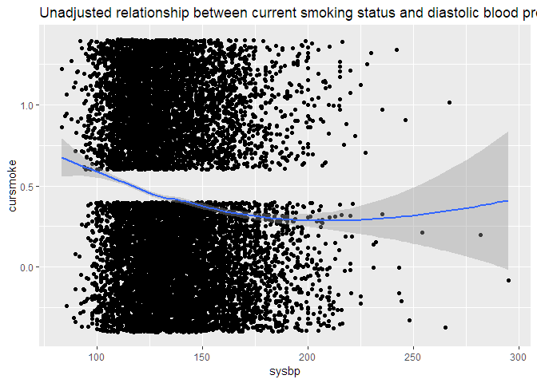

    ## # A tibble: 3 x 6
    ##   variable    OR lower_CI upper_CI conf_OR confounder
    ##   <chr>    <dbl>    <dbl>    <dbl>   <dbl> <lgl>     
    ## 1 diabp    0.966    0.966    0.966   0.953 TRUE      
    ## 2 prevhyp  0.966    0.966    0.966   0.978 TRUE      
    ## 3 hyperten 0.966    0.966    0.966   0.971 TRUE

    ## Warning in checkConv(attr(opt, "derivs"), opt$par, ctrl = control
    ## $checkConv, : Model failed to converge with max|grad| = 0.546003 (tol =
    ## 0.001, component 1)

    ## Warning in checkConv(attr(opt, "derivs"), opt$par, ctrl = control$checkConv, : Model is nearly unidentifiable: very large eigenvalue
    ##  - Rescale variables?

    ## Generalized linear mixed model fit by maximum likelihood (Laplace
    ##   Approximation) [glmerMod]
    ##  Family: binomial  ( logit )
    ## Formula: cursmoke ~ diabp_c + sysbp_c + prevhyp + hyperten + (1 | randid)
    ##    Data: frmgham
    ## 
    ##      AIC      BIC   logLik deviance df.resid 
    ##  11570.6  11614.8  -5779.3  11558.6    11621 
    ## 
    ## Scaled residuals: 
    ##     Min      1Q  Median      3Q     Max 
    ## -2.5272 -0.2154 -0.1233  0.2498  3.2823 
    ## 
    ## Random effects:
    ##  Groups Name        Variance Std.Dev.
    ##  randid (Intercept) 21.23    4.607   
    ## Number of obs: 11627, groups:  randid, 4434
    ## 
    ## Fixed effects:
    ##               Estimate Std. Error z value Pr(>|z|)    
    ## (Intercept)  0.2448667  0.0001298  1887.0   <2e-16 ***
    ## diabp_c      0.0403299  0.0001298   310.7   <2e-16 ***
    ## sysbp_c     -0.0360534  0.0001300  -277.3   <2e-16 ***
    ## prevhyp1    -0.9957484  0.0001298 -7673.7   <2e-16 ***
    ## hyperten    -1.2052589  0.0001298 -9288.1   <2e-16 ***
    ## ---
    ## Signif. codes:  0 '***' 0.001 '**' 0.01 '*' 0.05 '.' 0.1 ' ' 1
    ## 
    ## Correlation of Fixed Effects:
    ##          (Intr) dibp_c sysbp_ prvhy1
    ## diabp_c  0.000                      
    ## sysbp_c  0.000  0.000               
    ## prevhyp1 0.000  0.000  0.000        
    ## hyperten 0.000  0.000  0.000  0.000 
    ## convergence code: 0
    ## Model failed to converge with max|grad| = 0.546003 (tol = 0.001, component 1)
    ## Model is nearly unidentifiable: very large eigenvalue
    ##  - Rescale variables?

(2)The relationship between current smoking status and diastolic blood pressure.

    ## Beginning Cgee S-function, @(#) geeformula.q 4.13 98/01/27

    ## running glm to get initial regression estimate

    ## (Intercept)       diabp 
    ##  0.83258871 -0.01331811

    ## Beginning Cgee S-function, @(#) geeformula.q 4.13 98/01/27
    ## running glm to get initial regression estimate

    ##  (Intercept)        diabp        sysbp 
    ##  1.201158028  0.009278866 -0.016517237

    ## Beginning Cgee S-function, @(#) geeformula.q 4.13 98/01/27
    ## running glm to get initial regression estimate

    ##   (Intercept)         diabp      prevhyp1 
    ## -0.0606238215  0.0007722528 -0.6125294096

    ## Beginning Cgee S-function, @(#) geeformula.q 4.13 98/01/27
    ## running glm to get initial regression estimate

    ##  (Intercept)        diabp     hyperten 
    ##  0.561729741 -0.005909097 -0.464765767

    ## # A tibble: 3 x 6
    ##   variable    OR lower_CI upper_CI conf_OR confounder
    ##   <chr>    <dbl>    <dbl>    <dbl>   <dbl> <lgl>     
    ## 1 sysbp    0.994    0.992    0.997   1.01  TRUE      
    ## 2 prevhyp  0.994    0.992    0.997   1.000 TRUE      
    ## 3 hyperten 0.994    0.992    0.997   0.998 TRUE

    ## Beginning Cgee S-function, @(#) geeformula.q 4.13 98/01/27
    ## running glm to get initial regression estimate

    ## (Intercept)       diabp       sysbp    prevhyp1    hyperten 
    ##  0.42248755  0.01219174 -0.01035239 -0.35384039 -0.19034229

    ## 
    ##  GEE:  GENERALIZED LINEAR MODELS FOR DEPENDENT DATA
    ##  gee S-function, version 4.13 modified 98/01/27 (1998) 
    ## 
    ## Model:
    ##  Link:                      Logit 
    ##  Variance to Mean Relation: Binomial 
    ##  Correlation Structure:     Unstructured 
    ## 
    ## Call:
    ## gee(formula = cursmoke ~ diabp + sysbp + prevhyp + hyperten, 
    ##     id = randid, data = frmgham, family = binomial, corstr = ("unstructured"))
    ## 
    ## Summary of Residuals:
    ##        Min         1Q     Median         3Q        Max 
    ## -0.5772852 -0.4322399 -0.3434050  0.5378886  0.7834695 
    ## 
    ## 
    ## Coefficients:
    ##                 Estimate  Naive S.E.   Naive z Robust S.E.  Robust z
    ## (Intercept)  0.358492204 0.140153972  2.557845 0.136318579  2.629812
    ## diabp        0.009015059 0.001987666  4.535501 0.001937856  4.652079
    ## sysbp       -0.007680584 0.001185816 -6.477047 0.001125213 -6.825895
    ## prevhyp1    -0.251511525 0.040964453 -6.139751 0.038933722 -6.459992
    ## hyperten    -0.288846931 0.066297876 -4.356805 0.068177985 -4.236660
    ## 
    ## Estimated Scale Parameter:  0.9931821
    ## Number of Iterations:  3
    ## 
    ## Working Correlation
    ##           [,1]      [,2]      [,3]
    ## [1,] 1.0000000 0.7731811 0.5108965
    ## [2,] 0.7731811 1.0000000 0.5728086
    ## [3,] 0.5108965 0.5728086 1.0000000

From the table above, we found "sysbp", "prevhyp" and "hyperten" are confounders. After adding the confounders, the final model is shown above. For a one-unit increase in the diastolic blood pressure, the expected change in log odds is 0.009, adjusting for systolic blood pressure, prevalent hypertensive and hypertensive.

------------------------------------------------------------------------

(3)The relationship between current smoking status and serum total cholesterol. Again, while answering these questions, please account for any confounders that you have evidence may impact these relationships.

    ## Warning: Removed 409 rows containing missing values (position_stack).

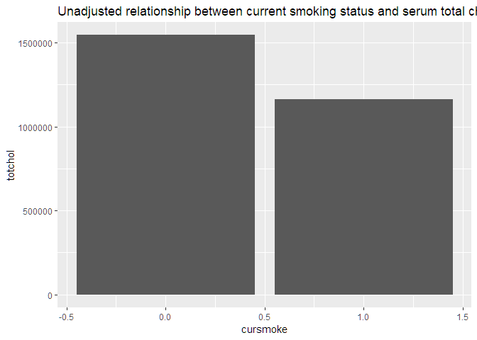

    ## Warning: Removed 409 rows containing non-finite values (stat_boxplot).

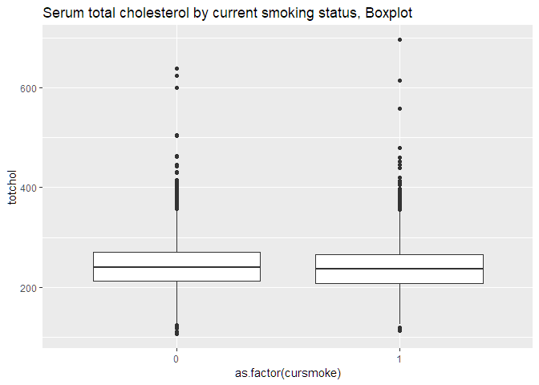

    ## Warning: Removed 409 rows containing non-finite values (stat_ydensity).

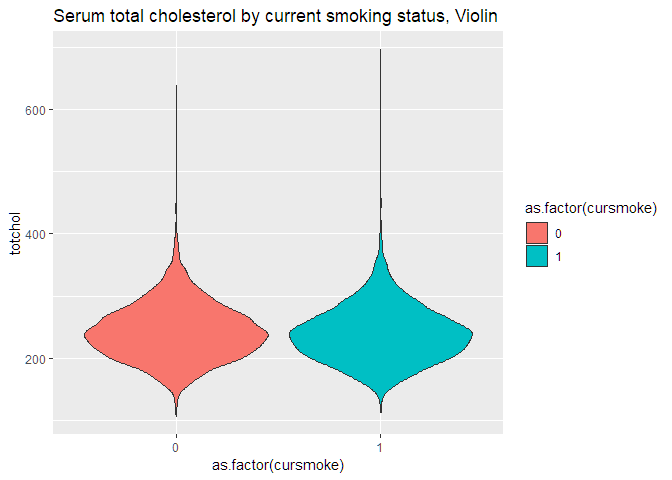

    ## 
    ##     0     1 
    ##   124 11503

Finding confounders
-------------------

    ## 
    ## Attaching package: 'nlme'

    ## The following object is masked from 'package:lme4':
    ## 
    ##     lmList

    ## The following object is masked from 'package:dplyr':
    ## 
    ##     collapse

    ##             cursmoke         age         sex     prevchd
    ## cursmoke  1.00000000 -0.25265497 -0.14784259 -0.04366411
    ## age      -0.25265497  1.00000000  0.02727738  0.21083836
    ## sex      -0.14784259  0.02727738  1.00000000 -0.09065342
    ## prevchd  -0.04366411  0.21083836 -0.09065342  1.00000000

    ## Linear mixed model fit by REML ['lmerMod']
    ## Formula: totchol ~ as.factor(cursmoke) * sex + bmi + age + prevstrk +  
    ##     prevchd + (1 | randid)
    ##    Data: frmgham
    ## 
    ## REML criterion at convergence: 112157.4
    ## 
    ## Scaled residuals: 
    ##     Min      1Q  Median      3Q     Max 
    ## -8.7041 -0.5235 -0.0170  0.4909  9.1018 
    ## 
    ## Random effects:
    ##  Groups   Name        Variance Std.Dev.
    ##  randid   (Intercept) 1299.6   36.05   
    ##  Residual              676.6   26.01   
    ## Number of obs: 11173, groups:  randid, 4405
    ## 
    ## Fixed effects:
    ##                            Estimate Std. Error t value
    ## (Intercept)               160.87147    4.33377  37.120
    ## as.factor(cursmoke)1        6.61384    1.28243   5.157
    ## sex2                       15.93314    1.47020  10.837
    ## bmi                         1.74143    0.12657  13.759
    ## age                         0.45485    0.04592   9.905
    ## prevstrk1                  -2.50961    3.39507  -0.739
    ## prevchd1                   -2.35991    1.56937  -1.504
    ## as.factor(cursmoke)1:sex2  -5.23787    1.80379  -2.904
    ## 
    ## Correlation of Fixed Effects:
    ##             (Intr) as.()1 sex2   bmi    age    prvst1 prvch1
    ## as.fctr(c)1 -0.309                                          
    ## sex2        -0.230  0.453                                   
    ## bmi         -0.761  0.075  0.043                            
    ## age         -0.571  0.161 -0.011 -0.029                     
    ## prevstrk1    0.034  0.006  0.000  0.009 -0.085              
    ## prevchd1     0.057  0.041  0.081  0.032 -0.217 -0.058       
    ## as.fct()1:2  0.079 -0.682 -0.551  0.029  0.013 -0.010 -0.031

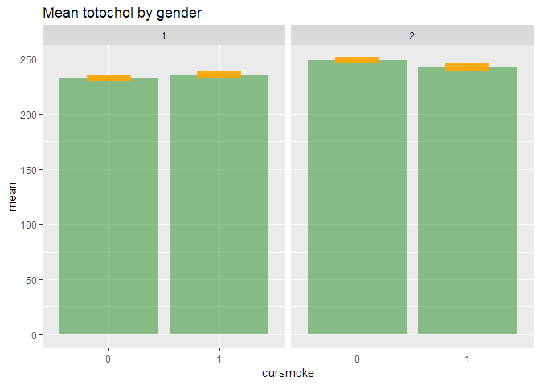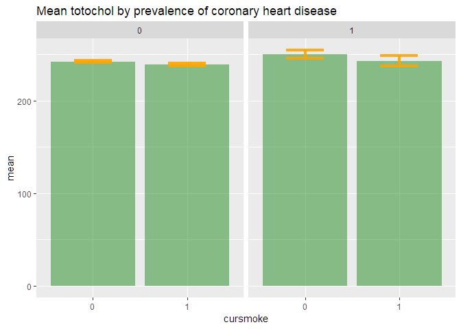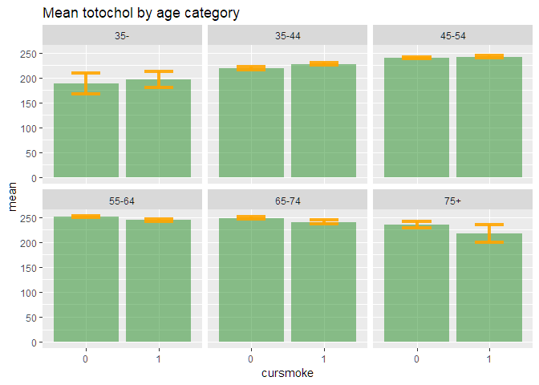

    ## Warning in qt((1 - 0.05)/2 + 0.5, n - 1): NaNs produced

    ## Warning in qt((1 - 0.05)/2 + 0.5, n - 1): NaNs produced

    ## Warning: Removed 2 rows containing missing values (geom_errorbar).

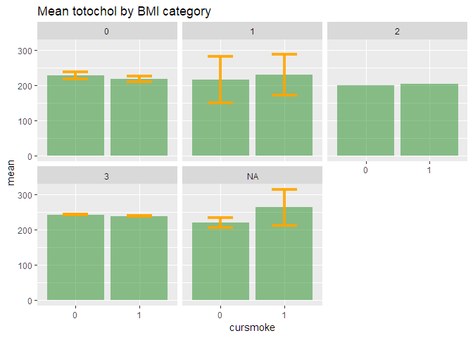 From the table above, we found age, ldlc and hdlc are confounders. \#\# bootstrap for confidence interval

    ## BOOTSTRAP CONFIDENCE INTERVAL CALCULATIONS
    ## Based on 200 bootstrap replicates
    ## 
    ## CALL : 
    ## boot::boot.ci(boot.out = b_par, type = "basic", index = 2)
    ## 
    ## Intervals : 
    ## Level      Basic         
    ## 95%   ( 3.616,  9.210 )  
    ## Calculations and Intervals on Original Scale
    ## Some basic intervals may be unstable
